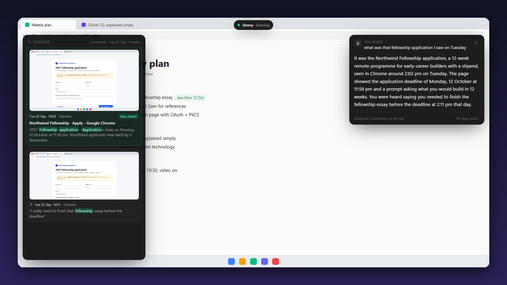
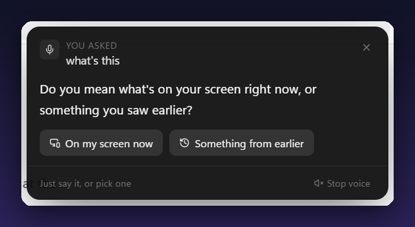
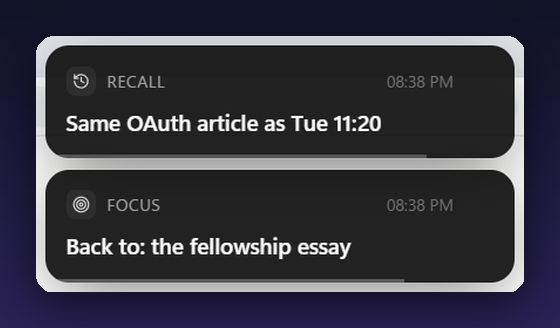
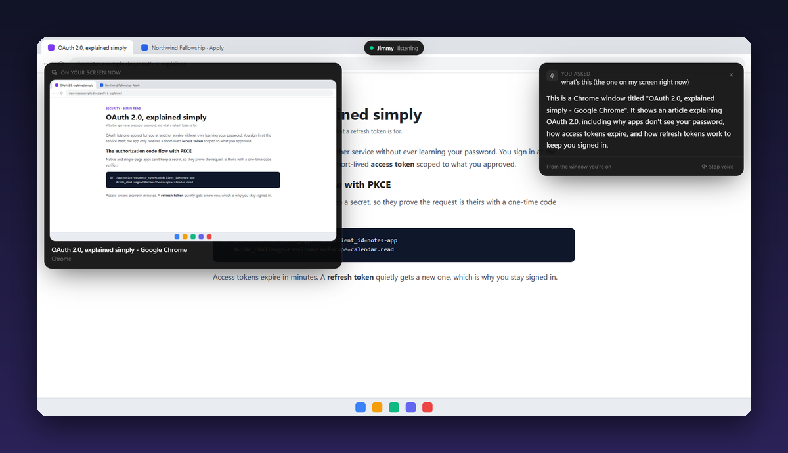
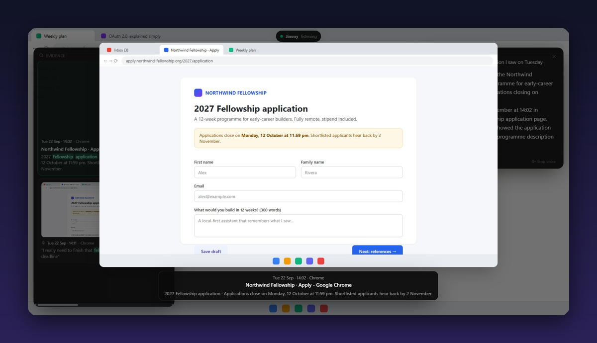
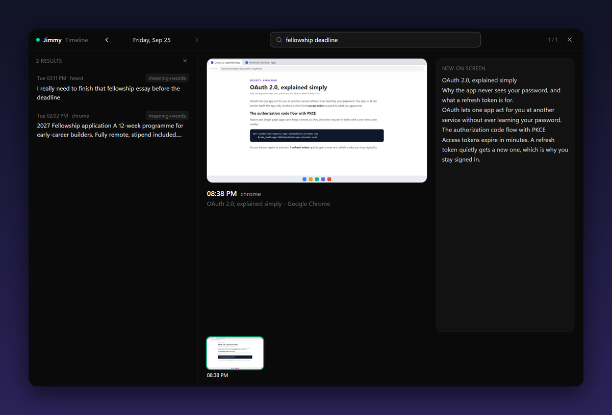
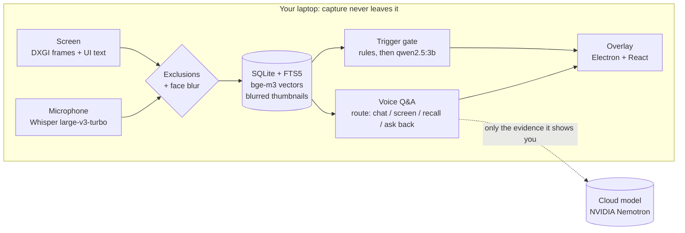

<p align="center">
  
</p>

<h1 align="center">Jimmy</h1>

<p align="center">
  <b>An always-on assistant for Windows 11 that remembers what you saw and heard,<br>
  answers when you ask, and otherwise stays quiet.</b>
</p>

<p align="center">
  
  
  
  
  
</p>

<p align="center">
  <a href="#talk-to-it">Talk to it</a> ·
  <a href="#what-it-looks-like">Screenshots</a> ·
  <a href="#quick-start">Quick start</a> ·
  <a href="#how-it-works">How it works</a> ·
  <a href="#privacy-by-construction">Privacy</a> ·
  <a href="#project-docs">Docs</a>
</p>

---

> **Continuous capture is commodity. The product is the gate that decides to stay quiet.**
> Jimmy is built for six good interruptions an evening, not for throughput.

- **It remembers.** Your screen's text and what's said near the mic become one
  searchable history, with a blurred screenshot for every moment.
- **You just ask.** Say *"Jimmy, …"* out loud. You don't type, and you don't
  need to know the right keywords.
- **It shows its work.** Every answer sits beside the actual moments it came from.
- **It knows when to shut up.** At most 4 cards an hour, never two within 10
  minutes. Silence is the default.

---

## Talk to it

While `ambient run` is going, say **"Jimmy,"** and then your question.

| You say | Jimmy |
|---|---|
| *"Jimmy, what was that fellowship application I saw on Tuesday?"* | Searches Tuesday by meaning, not just words, and answers aloud. The moments it used appear on the left. |
| *"Jimmy, and when does it close?"* | A follow-up. It remembers the conversation for a few minutes. |
| *"Jimmy, show me the best match"* | Opens that screenshot full size. *"Open the second one"* works too. |
| *"Jimmy, what's on my screen?"* | Describes the window in front of you, with a large view of it. |
| *"Jimmy, what's this?"* | Can't tell if you mean **now** or **earlier**, so it asks, then waits for your answer. No wake word needed for the reply. |
| *"Jimmy, can you hear me?"* · *"what can you do?"* | Just talks. No search. |

It understands days and times: *today*, *yesterday afternoon*, *on Tuesday*,
*between 2 and 3*, *the last 20 minutes*. Say just **"Jimmy"** and pause if you
want to think first. To type instead, press **Ctrl + Alt + Space**.

---

## What it looks like

<table>
  <tr>
    <td width="50%" valign="top">
      <br>
      <b>It asks when it isn't sure.</b> "What's this?" could mean the screen
      now or one from last week. Answer out loud or tap a button.
    </td>
    <td width="50%" valign="top">
      <br>
      <b>Cards, rarely.</b> <b>RECALL</b> links what you're doing to a concrete
      earlier moment. <b>FOCUS</b> nudges you back, but only if you told Jimmy what
      you meant to do.
    </td>
  </tr>
  <tr>
    <td width="50%" valign="top">
      <br>
      <b>What's on my screen.</b> It reads the window you're on and
      answers from that alone, never from an earlier answer.
    </td>
    <td width="50%" valign="top">
      <br>
      <b>See the moment.</b> "Show me the best match" (or a click) opens the
      evidence full size.
    </td>
  </tr>
  <tr>
    <td colspan="2" valign="top">
      <br>
      <b>The timeline</b> (<b>Ctrl + Alt + T</b>). Your day as a strip of blurred screenshots,
      one per minute. Search it the way you remember it: <i>"fellowship deadline"</i>
      finds the page even if those words never appeared together.
    </td>
  </tr>
</table>

<sub>Every screenshot above is the real overlay and the real model, run on an invented set
of pages ("Northwind Fellowship", "Alex Rivera"), so no personal data appears.</sub>

---

## Quick start

**You need:** Windows 11, an NVIDIA GPU, **Python 3.12** (not 3.14: the ML
wheels don't exist there yet), Node.js, and [Ollama](https://ollama.com).

**1. Install.**

```powershell
cd C:\Code\Jimmy
py -3.12 -m venv .venv
.\.venv\Scripts\python.exe -m pip install -r requirements.txt
cd overlay; npm install; npm run build; cd ..
```

**2. Pull the two local models.** One decides cards; the other powers meaning search.

```bash
ollama pull qwen2.5:3b
```

```bash
ollama pull bge-m3
```

**3. Add a key for spoken answers** (optional). It's free at
[build.nvidia.com](https://build.nvidia.com): open any model, click **Get API
Key**, then:

```bash
setx NVIDIA_API_KEY "nvapi-your-key-here"
```

Without a key Jimmy still works, offline. Each answer shows what it *found*,
which is exactly what would have been sent to the model.

**4. Check, then run.**

```powershell
.\.venv\Scripts\python.exe -m ambient doctor   # what actually works on this machine
.\.venv\Scripts\python.exe -m ambient run      # capture + overlay, until you quit
```

`doctor` asks you to speak for 3 seconds to prove the mic hears you. Whisper
downloads its weights on the first run and caches them after that.

### Everyday controls

| Action | How |
|---|---|
| Ask | Say *"Jimmy, …"*, or **Ctrl + Alt + Space** to type |
| Pause capture (and resume) | **Ctrl + Alt + J**, or hover the pill → **Pause 2h** |
| Open the timeline | **Ctrl + Alt + T**, or hover the pill → **Timeline** |
| Silence an answer | **Stop voice** on the answer panel |
| Dismiss a card | Hover it, click **×**. Jimmy then stays quiet for 30 minutes |
| Quit cleanly | Hover the pill → **Quit**, or **Ctrl + C** in the terminal |

<details>
<summary><b>More commands</b>: search, chat, focus, replay, demo mode</summary>

```powershell
# Search your history (keywords + meaning, within any time you name)
.\.venv\Scripts\python.exe -m ambient search "consulting application on Friday"
.\.venv\Scripts\python.exe -m ambient index     # backfill meaning search for older captures
.\.venv\Scripts\python.exe -m ambient stats

# Chat in the terminal
.\.venv\Scripts\python.exe -m jimmy chat         # /context shows exactly what was sent
.\.venv\Scripts\python.exe -m jimmy ask "what was I reading yesterday?"
.\.venv\Scripts\python.exe -m jimmy remember "standup is at 10:30 on weekdays"
.\.venv\Scripts\python.exe -m jimmy doctor

# Cards
.\.venv\Scripts\python.exe -m jimmy focus "finish the fellowship essay"   # enables FOCUS nudges
.\.venv\Scripts\python.exe -m ambient replay     # what the gate would have said over your history

# Variations
.\.venv\Scripts\python.exe -m ambient run --no-overlay        # terminal only
.\.venv\Scripts\python.exe -m ambient run --seconds 60 --no-audio
```

**Recording a demo.** `ambient run --demo` walks through a scripted tour in
about 3 minutes, spoken aloud: a card, a chat, a question about the past, the
screenshot opened big, a follow-up, *"what's this?"* with Jimmy asking back, and
*"what can you do?"*. Only the questions are scripted. Capture, search, the
model and the voice are all real. Put the window you want described in front
before the *"what's this?"* step. To use your own script: `--demo my_script.txt`
(the format is at the top of `ambient/demo.py`).

</details>

---

## How it works



- **Capture is gated.** A 160×90 change detector skips about half of all ticks.
  Text comes from UI Automation, with Chromium's accessibility tree woken up so
  browsers and Electron apps are readable.
- **Search is hybrid.** Keyword matches (FTS5) and meaning matches (bge-m3,
  local) are fused, so *"consulting application"* finds a page titled
  "McKinsey Forward".
- **The model never writes a card.** It answers yes/no questions. Code writes
  the card from words that exist in the evidence and real timestamps, so a card
  can't contain anything invented.
- **One LLM client** (`jimmy/llm.py`) serves the whole repo. Captured text only
  reaches it inside a `<context>` block, below a rule to ignore any instructions
  found there.

The details are in [`ARCHITECTURE.md`](ARCHITECTURE.md) and [`DATA-FLOW.md`](DATA-FLOW.md).

---

## Privacy by construction

These are absent code paths, not settings that happen to be off.

| Stored | Never stored |
|---|---|
| Window app and title | Any raw, unblurred frame |
| UI text and OCR text | Face embeddings or any biometric template |
| Blurred thumbnails | Anything from an excluded surface |
| Transcribed speech | Raw audio: only the transcript survives |
| Face **count** per frame | Face identity, names, cross-day links |

- **Faces are blurred before anything is written.** The clean frame exists only
  inside one tick. The blur is verified against the detector, not by eye: a test
  re-runs face detection on the saved JPEG and requires zero hits. There is no
  `faces` table and no `people` table. That absence is the design.
- **Excluded surfaces are never captured:** password managers, banking and
  payment sites, private/incognito windows, and Jimmy's own windows. Add your own
  in `data\exclusions.txt`, one per line:
  ```
  exe:mysecret.exe
  title:payroll
  url:internal\.example\.com
  ```
- **The mic pauses on sensitive screens,** so an OTP read aloud never reaches a
  transcript. The one exception: if another app (Teams, Zoom, Meet) is using the
  mic, recording continues so a meeting isn't lost.
- **Recording others is off.** System audio (the far end of a call) is not
  captured. That's a consent problem, not a feature flag.
- **What leaves the laptop:** only the evidence shown with an answer (at most
  6,000 characters, and only with a key set), plus the rare RECALL card
  candidates the cloud double-checks. Set `JIMMY_RECALL_VERIFY=none` to keep
  cards fully local.

A face embedding is a biometric template under India's DPDP Act whether or not
it's persisted. This design shrinks that exposure substantially; it does not
take it to zero.

<details>
<summary><b>Storage, microphone and tuning</b></summary>

- **Storage.** Measured at 25.8 MB per captured hour with 640 px thumbnails
  (about 6 GB a month at 8 hours a day). Thumbnails are now 1280 px so they're
  readable when opened big, which costs roughly 2–3× that. It's all on your own
  disk, and there's no retention policy yet.
- **Which microphone.** Capture uses the Windows default input. To pick another,
  set `MIC_DEVICE` in `ambient/config.py` to part of its name, for example
  `"Microphone Array"`. A quiet room can read as near-silent because of noise
  suppression, so test by speaking during `ambient doctor`.
- **OCR is optional.** Without the Tesseract binary, canvas-rendered apps and
  video contribute no text. Normal apps are unaffected.
- **Every tunable** lives in [`ambient/config.py`](ambient/config.py), with its
  reasoning next to it.

</details>

---

## Status

| Stage | What it delivers | |
|---|---|:-:|
| 1 · Capture | Screen and speech into searchable text, faces blurred, exclusions first | ✅ |
| 2 · Jimmy core | One LLM client, memory, the plugin seam, terminal chat | ✅ |
| 3 · Trigger gate | RECALL and FOCUS cards, blind-judged before shipping | ✅ |
| 4 · Overlay | The pill, cards and answers: transparent, click-through, never steals focus | ✅ |
| 5 · Recall | Hybrid keyword + meaning search and the timeline | ✅ |
| + · Voice | "Jimmy, …", spoken answers, conversation, asking back | ✅ |

What's next lives in [`SCOPE.md`](SCOPE.md) → *Possible future changes*. The
biggest one: the model reads text, not pixels, so windows that UI Automation
can't reach (canvases, video, some apps' main panes) aren't described yet.

<details>
<summary><b>Checks</b>: 59 assert-based checks, no framework</summary>

```powershell
.\.venv\Scripts\python.exe tests\test_stage1.py    # 15 · capture, blur, store
.\.venv\Scripts\python.exe tests\test_stage2.py    # 14 · LLM client, mocked network
.\.venv\Scripts\python.exe tests\test_stage3.py    # 11 · trigger gate, no network
.\.venv\Scripts\python.exe tests\test_stage4.py    #  5 · overlay API and window flags
.\.venv\Scripts\python.exe tests\test_stage5.py    # 14 · recall, voice, ask-back, demo
```

OpenCV prints `net_impl_backend ... Targets are not supported` on import. It's harmless.

</details>

---

## Project docs

| Doc | What's in it |
|---|---|
| [`AMBIENT_LAYER.md`](AMBIENT_LAYER.md) | The build spec: the authority on what to build and what not to |
| [`ARCHITECTURE.md`](ARCHITECTURE.md) | Components, threading, and why each choice was made |
| [`DATA-FLOW.md`](DATA-FLOW.md) | The capture tick, the audio path, the schema |
| [`DECISIONS-AND-WHY.md`](DECISIONS-AND-WHY.md) | Every non-obvious call, with the evidence behind it |
| [`SCOPE.md`](SCOPE.md) | What's in, what's out, what's owed |
| [`TIMELINE.md`](TIMELINE.md) | Stage status and acceptance gates |
| [`CLAUDE.md`](CLAUDE.md) | Orientation for AI coding sessions; verified environment facts |
