<p align="center">
  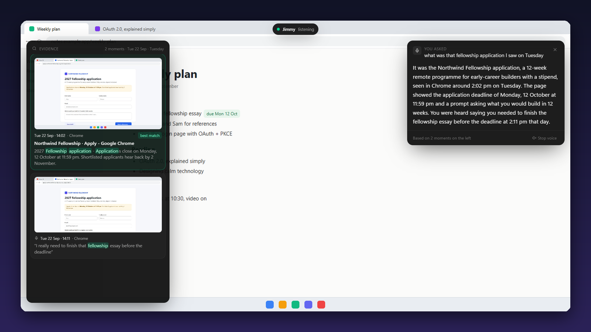
</p>

<h1 align="center">Jimmy</h1>

<p align="center">
  <b>An always-on assistant for Windows 11 that remembers what you saw and heard,<br>
  answers out loud when you ask, and otherwise stays quiet.</b>
</p>

<p align="center">
  
  
  
  
  
  <br>
  
  
  
  
  
</p>

<p align="center">
  <a href="#-a-day-with-jimmy">A day with Jimmy</a> ·
  <a href="#-talk-to-it">Talk to it</a> ·
  <a href="#-what-it-looks-like">Screenshots</a> ·
  <a href="#-quick-start">Quick start</a> ·
  <a href="#%EF%B8%8F-how-it-works">How it works</a> ·
  <a href="#%EF%B8%8F-privacy-by-construction">Privacy</a> ·
  <a href="#-engineering-notes">Engineering notes</a> ·
  <a href="#-project-docs">Docs</a>
</p>

---

> ### Continuous capture is commodity. The product is the gate that decides to stay quiet.
>
> Jimmy is built for **six good interruptions an evening**, not for throughput.
> Every card is at most a handful of words, written by code from your own data,
> and silence is the default.

<table>
  <tr>
    <td width="33%" valign="top">
      <h3>🧠 It remembers</h3>
      Your screen's text and the speech near your mic become one searchable
      history, with a blurred screenshot for every moment.
    </td>
    <td width="33%" valign="top">
      <h3>🎙️ You just ask</h3>
      Say <i>"Jimmy, …"</i> in English or Hindi. No typing, no keywords: it searches
      by <b>meaning</b>, inside whatever time you name.
    </td>
    <td width="33%" valign="top">
      <h3>🔎 It shows its work</h3>
      Every answer sits beside the actual moments it came from. Click one to
      see it full size.
    </td>
  </tr>
  <tr>
    <td width="33%" valign="top">
      <h3>🤫 It knows when to shut up</h3>
      At most 4 cards an hour, never two within 10 minutes, and 30 minutes of
      quiet after you dismiss one.
    </td>
    <td width="33%" valign="top">
      <h3>🙋 It proposes, you approve</h3>
      Focus, drafts, calendar events, opening a page: each waits for your
      <i>"yes"</i>. Nothing is sent or saved behind your back.
    </td>
    <td width="33%" valign="top">
      <h3>🛡️ Private by construction</h3>
      Faces are blurred before anything touches disk. Banking, password managers and
      incognito windows are never captured, and that rule shipped before the first run.
    </td>
  </tr>
  <tr>
    <td width="33%" valign="top">
      <h3>🤖 It does things</h3>
      <i>"Search YouTube for CarryMinati"</i>: a short plan, one <i>"yes"</i>, then its own
      cursor types and presses, checking each step worked.
    </td>
    <td width="33%" valign="top">
      <h3>🔒 Rules in code, not in a prompt</h3>
      A policy layer judges every action before it's shown: no password boxes, no words you
      didn't say, no site you didn't name without asking.
    </td>
    <td width="33%" valign="top">
      <h3>🪶 Light on your laptop</h3>
      Background work runs in Windows' efficiency mode, waits on battery or a busy CPU,
      and capture slows down when you're idle.
    </td>
  </tr>
</table>

---

## 🌅 A day with Jimmy

What an ordinary day looks like with Jimmy running. Every line in bold quotes
follows a real card or answer format from the code.

| When | What happens |
|---|---|
| **09:12**: you sit down | The curtain lifts as soon as the webcam sees you facing the screen. A card: **"Left off: Fellowship essay · draft 2"**. |
| **11:40**: deep in VS Code | Nothing. Jimmy is capturing, indexing and deciding, silently. Most hours produce no card at all. |
| **13:31**: you open a form | A **RECALL** card: **"Same Northwind Fellowship as Tue 15:02"**. It linked what's on screen now to a concrete earlier moment. |
| **14:05**: *"Jimmy, when does it close?"* | It searches Tuesday by meaning, shows the screenshots it used, and answers out loud in about a second. |
| **15:30**: you drift to YouTube | You told it *"focus on the essay"* earlier, so you get one **FOCUS** nudge. After that it stays quiet for 45 minutes. |
| **16:02**: you step away | Out of the camera's view for 1.5 seconds, so the **privacy curtain** comes down and Jimmy rests: no capture, no listening. Looking away or down at your phone never counts. |
| **17:00**: the day before a deadline | **"Tomorrow: Northwind Fellowship"**. It noticed a date on a page, and the local model agreed it was a deadline. |
| **21:00**: wrapping up | One recap card: **"Today: 10h 42m, mostly VS Code"**. Ask *"how was my day?"* to get the chart. |

---

## 💬 Talk to it

While `ambient run` is going, say **"Jimmy,"** and then what you want. Or skip the name: look at
the screen and ask (an eye in the pill shows Jimmy sees you looking), and after Jimmy answers,
just keep talking for 10 seconds, like a conversation. *"Thanks"* ends it. Say **"Jimmy, eye
calibration"** once (about 20 seconds, guided on screen) so it knows your camera, your eyes and
your lips. On a call (another app has the mic, Discord in a voice channel counts), looking isn't
enough and the pill says so; *"Jimmy, I'm not on a call"* if you aren't.

<table>
<tr><th width="20%">Kind</th><th width="42%">You say</th><th>Jimmy</th></tr>
<tr>
  <td><b>Ask about the past</b></td>
  <td><i>"Jimmy, what was that fellowship application I saw on Tuesday?"</i><br><i>"…and when does it close?"</i></td>
  <td>Hybrid keyword + meaning search inside that day. The evidence goes on the left, a spoken answer on the right, and follow-ups work for 3 minutes.</td>
</tr>
<tr>
  <td><b>Ask about now</b></td>
  <td><i>"Jimmy, what's on my screen?"</i></td>
  <td>Reads the window in front of you and answers from that alone, never from an earlier answer.</td>
</tr>
<tr>
  <td><b>When it's unclear</b></td>
  <td><i>"Jimmy, what's this?"</i></td>
  <td>Asks whether you mean <b>now</b> or <b>earlier</b>, then waits. Your reply needs no wake word.</td>
</tr>
<tr>
  <td><b>Your time</b></td>
  <td><i>"how was my day?"</i> · <i>"how long was I on YouTube?"</i> · <i>"last time I used Discord?"</i> · <i>"my routine last month"</i></td>
  <td>Instant, with no model involved: one line written by code, plus a chart. <i>"And yesterday?"</i> follows on.</td>
</tr>
<tr>
  <td><b>Show me</b></td>
  <td><i>"show me the best match"</i> · <i>"show me yesterday at 3"</i> · <i>"open insights"</i></td>
  <td>Opens the screenshot full size, or the timeline at that moment.</td>
</tr>
<tr>
  <td><b>Hands-free</b></td>
  <td><i>"next"</i> · <i>"go back"</i> · <i>"scroll down"</i> · <i>"only Chrome"</i> · <i>"close it"</i></td>
  <td>No wake word needed for 45 s after Jimmy shows you something.</td>
</tr>
<tr>
  <td><b>Reminders</b></td>
  <td><i>"remind me at 5 to call Sam"</i> · <i>"…when I open Discord"</i></td>
  <td>A card and a spoken reminder, at that time or when that app comes up.</td>
</tr>
<tr>
  <td><b>Timers</b></td>
  <td><i>"set a timer for 10 minutes"</i> · <i>"5 minute timer to check the oven"</i> · <i>"how much time is left?"</i> · <i>"cancel the timer"</i></td>
  <td>Counts down on the pill, over whatever window you're in, then rings.</td>
</tr>
<tr>
  <td><b>Forget</b></td>
  <td><i>"delete everything from September"</i> · <i>"…from 1 to 15 September"</i> · <i>"forget the last hour"</i></td>
  <td>Says what it would delete (screenshots, lines heard, MB) and waits for your <i>"yes"</i>. Then the space comes back.</td>
</tr>
<tr>
  <td><b>Your lists</b></td>
  <td><i>"show me my reminders"</i> · <i>"move the railway reminder to 10 tomorrow"</i> · <i>"my new goal is to learn AWS"</i> · <i>"mark the essay done"</i> · <i>"remember my standup moved to 11"</i> · <i>"what do you know about me?"</i></td>
  <td>Reminders, goals and the things you told it, read and changed by voice. The <b>Memory</b> tab (timeline window, key 3) lists them to edit, tick off, select and delete, plus <b>your wiki</b>: what Jimmy knows about you (projects, people, habits), which you confirm or delete.</td>
</tr>
<tr>
  <td><b>Hands</b></td>
  <td><i>"click Sign in"</i> · <i>"the blue link"</i> · <i>"search YouTube for CarryMinati"</i> · <i>"close this tab"</i> · <i>"open Chrome"</i> · <i>"close Discord"</i></td>
  <td>A task gets a short plan and one <i>"yes"</i>; Jimmy's own cursor then does the steps back to back, checking after each one that it worked (the box holds the text, the page changed), and stops at the first surprise. Anything that can't be undone, or a site you didn't name, asks again. Through Windows' accessibility, never your mouse. It understands controls by name, and by look ("the yellow icon") by looking at the screen.</td>
</tr>
<tr>
  <td><b>About Jimmy</b></td>
  <td><i>"do you have a cursor?"</i> · <i>"am I on a call?"</i> · <i>"what did you just do?"</i> · <i>"Discord isn't a call"</i></td>
  <td>Answered from its live state. Every request is logged: <code>python -m jimmy trace</code>.</td>
</tr>
<tr>
  <td><b>Proposals</b></td>
  <td><i>"draft a reply to this"</i> · <i>"add this to my calendar"</i> · <i>"open that page"</i></td>
  <td>A draft goes to your clipboard; an event goes to your calendar app, which asks once more; a page opens in your browser. Nothing goes further without your <i>"yes"</i>.</td>
</tr>
<tr>
  <td><b>Control</b></td>
  <td><i>"pause for 30 minutes"</i> · <i>"focus on the essay"</i> · <i>"curtain"</i> · <i>"close your UI"</i> · <i>"copy the text on my screen"</i></td>
  <td>Does it and confirms in the pill.</td>
</tr>
<tr>
  <td><b>Your windows</b></td>
  <td><i>"what's open on my PC?"</i> · <i>"switch to Chrome"</i> · <i>"minimize VS Code"</i> · <i>"maximize the window"</i></td>
  <td>Lists, switches, minimizes or maximizes apps after your <i>"yes"</i>. Minimizing never closes anything.</td>
</tr>
<tr>
  <td><b>Voice & face</b></td>
  <td><i>"speak softer"</i> · <i>"mute your voice"</i> · <i>"remember my face"</i> · <i>"forget my face"</i></td>
  <td>Your settings are remembered. Face enrolment is guided on screen and takes about 20 seconds.</td>
</tr>
<tr>
  <td><b>Just chat</b></td>
  <td><i>"can you hear me?"</i> · <i>"what can you do?"</i></td>
  <td>Just talks, without searching your history.</td>
</tr>
</table>

It understands times like *today*, *yesterday afternoon*, *on Tuesday*, *between 2 and 3*,
*the last 20 minutes*, *an hour ago* and *last Friday*. Say just **"Jimmy"** if you want to think
first: it answers *"Yes?"* and listens. To type instead, press **Ctrl + Alt + Space**. If a request
doesn't match any rule, the cloud model picks one of Jimmy's own tools, asks you a short question back,
or says plainly that it can't. Say *"stop"* to end a task that's running; if the model is slow, Jimmy says so.

---

## 📸 What it looks like

<table>
  <tr>
    <td colspan="2" valign="top">
      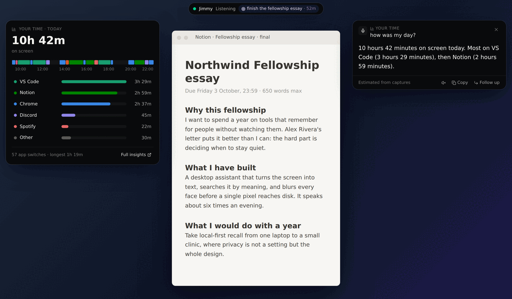<br>
      <b>"Jimmy, how was my day?"</b> The answer is instant and no model is involved. Code writes the line,
      and the chart shows where the time went. Click any block on the ribbon to jump to that moment.
    </td>
  </tr>
  <tr>
    <td width="50%" valign="top">
      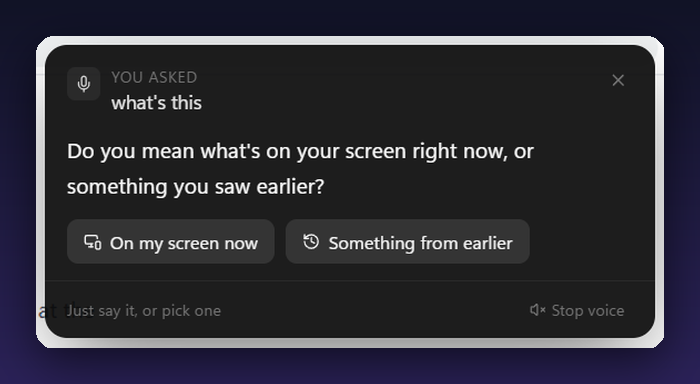<br>
      <b>It asks when it isn't sure.</b> "What's this?" could mean the screen
      now or one from last week. Answer out loud or tap a button.
    </td>
    <td width="50%" valign="top">
      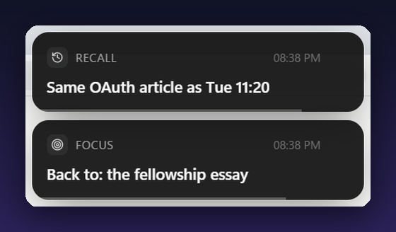<br>
      <b>Cards, rarely.</b> <b>RECALL</b> links what you're doing to a concrete
      earlier moment. <b>FOCUS</b> nudges you back, but only if you told Jimmy what
      you meant to do.
    </td>
  </tr>
  <tr>
    <td width="50%" valign="top">
      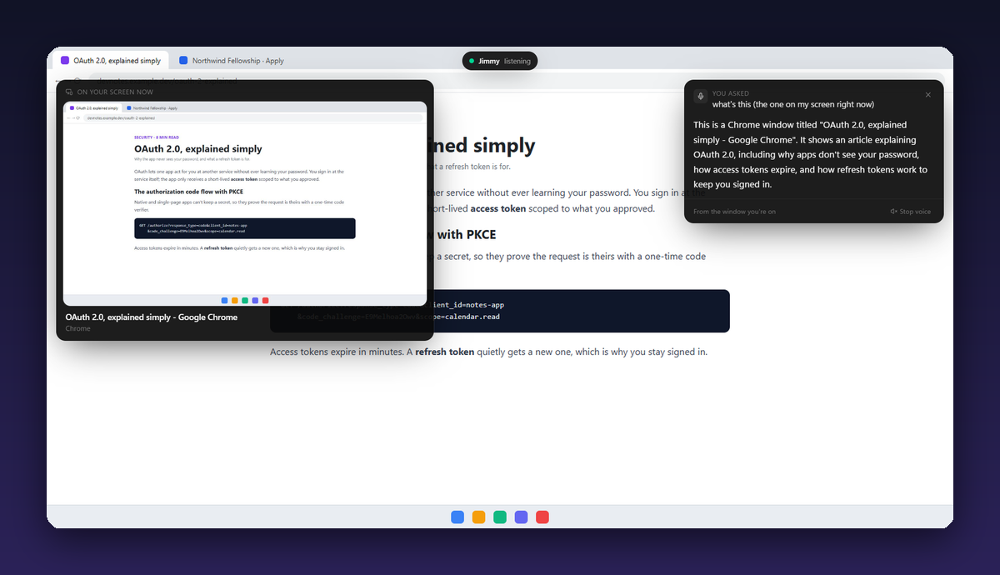<br>
      <b>What's on my screen.</b> It reads the window you're on and
      answers from that alone.
    </td>
    <td width="50%" valign="top">
      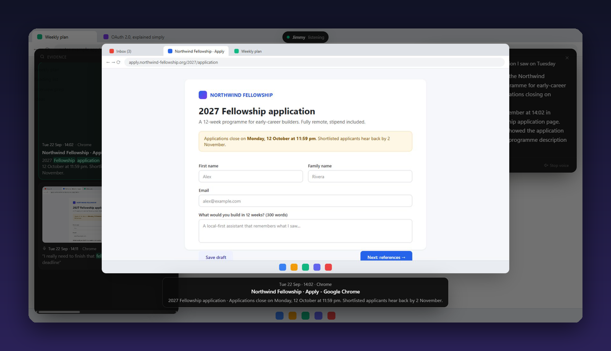<br>
      <b>See the moment.</b> <i>"Show me the best match"</i> (or a click) opens the
      evidence full size.
    </td>
  </tr>
  <tr>
    <td colspan="2" valign="top">
      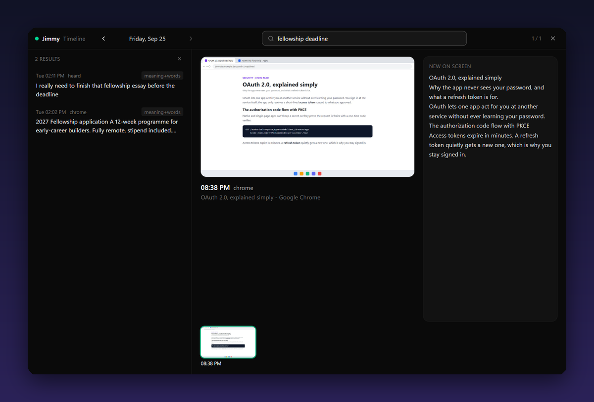<br>
      <b>The timeline</b> (<b>Ctrl + Alt + T</b>). Your day as a strip of blurred screenshots.
      Search it the way you remember it: <i>"fellowship deadline"</i> finds the page even if those
      words never appeared together.
    </td>
  </tr>
  <tr>
    <td colspan="2" valign="top">
      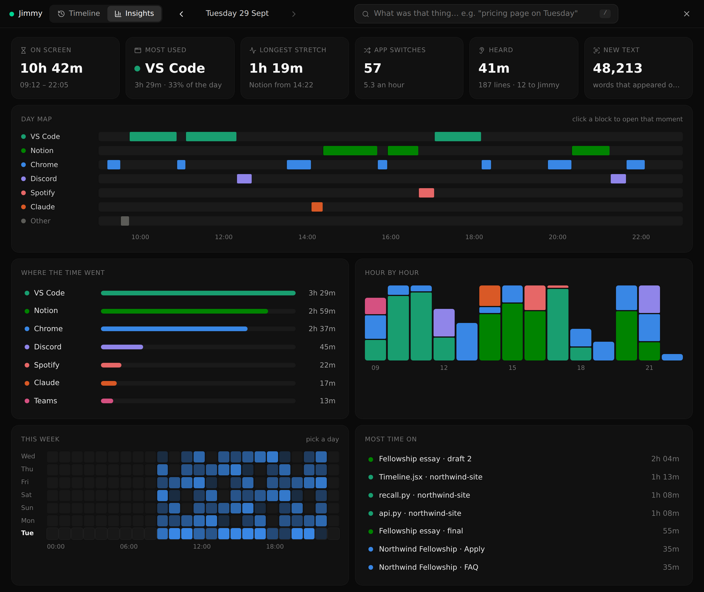<br>
      <b>Insights</b> (<b>Ctrl + Alt + I</b>). Where the day went: a day map with one lane per app,
      hour-by-hour bars, a week heatmap, and the pages you spent longest on. All of it is estimated
      from captures already on disk, with no new tracking and no model.
    </td>
  </tr>
</table>

<sub>Every screenshot is the real overlay UI showing invented pages and data ("Northwind
Fellowship", "Alex Rivera"), so no personal data appears.</sub>

---

## 🚀 Quick start

**You need:** Windows 11, an NVIDIA GPU (built on a 6 GB RTX 4050), **Python 3.12**
(not 3.14, which the ML wheels don't support yet), Node.js, and [Ollama](https://ollama.com).

**1 · Install**

```powershell
cd C:\Code\Jimmy
py -3.12 -m venv .venv
.\.venv\Scripts\python.exe -m pip install -r requirements.txt
cd overlay; npm install; npm run build; cd ..
```

**2 · Pull the two local models.** One decides cards; the other powers meaning search.

```bash
ollama pull qwen2.5:3b
ollama pull bge-m3
```

**3 · Add a key for spoken answers** (optional). It's free at
[build.nvidia.com](https://build.nvidia.com): open any model, click **Get API Key**, then:

```bash
setx NVIDIA_API_KEY "nvapi-your-key-here"
```

Or put `NVIDIA_API_KEY=nvapi-…` in a `.env` file in the repo folder (git ignores it).

To use OpenAI instead (paid; GPT-6 Luna is about ₹300–550 a month for normal use), put these
two lines in `.env`:

```
OPENAI_API_KEY=sk-your-key-here
JIMMY_PROVIDER=openai
```

Without a key, Jimmy still works offline. Each answer shows what retrieval *found*, which is
exactly what would have been sent to the model.

**4 · Check, then run**

```powershell
.\.venv\Scripts\python.exe -m ambient doctor   # what actually works on this machine
.\.venv\Scripts\python.exe -m ambient run      # capture + overlay, until you quit
```

`doctor` asks you to speak for 3 seconds to prove the mic hears you. Whisper downloads its
weights on the first run and caches them. Only one `ambient run` can go at a time; a second one
says so and exits.

**5 · Optional extras.** Jimmy runs without any of these. Each one is a flag in
[`ambient/config.py`](ambient/config.py) (or an environment variable), and each comment there
says what to measure before you leave it on.

| Extra | Install | Turn on | What you get |
|---|---|---|---|
| Windows OCR | `pip install winocr` | on by itself | Text from canvas apps, games and video, with no Tesseract install |
| Silero VAD | `pip install onnxruntime silero-vad` | `VAD_ENGINE = "silero"` | Fewer false speech segments in a noisy room, so fewer Whisper runs |
| Wake word while paused | `pip install openwakeword` + a "Jimmy" model at `models\jimmy.onnx` | `PAUSE_WAKEWORD = True` | The GPU idles through a pause; Whisper wakes only for the name |
| Natural voice | `pip install kokoro-onnx` + its model files in `models\` | `VOICE_ENGINE = "kokoro"` | A Kokoro voice instead of Windows', with Hindi voices |
| Turn detector | `pip install onnxruntime tokenizers` + a model folder | `TURN_DETECTOR = Path(...)` | A request cut at "and…" waits for the rest only when it sounds unfinished |
| Local fallback | `ollama pull qwen3:4b` | `JIMMY_LOCAL_TOOLS=qwen3:4b` | Agent steps keep working when the cloud is down |
| Lighter webcam, GPU, storage | none | `PRESENCE_STILL_SKIP`, `GPU_RELEASE_AWAY_S`, `JIMMY_EMBED_ON_CPU=1`, `VECTOR_INT8`, `SMALL_THUMBS_UNCHANGED_TEXT` | Fewer face checks while you sit still, VRAM freed while you're away, vectors at a quarter of the size, small screenshots for video |
| Recipes | none | `AGENT_RECIPES = True` | Jimmy remembers which buttons worked for a request and uses that next time |
| Trace file | none | `JIMMY_OTEL=1` | Every request as OpenTelemetry spans in `data\logs\otel.jsonl`, for Jaeger or Phoenix |

> **Just want to see the UI?** In `overlay\`, run `.\node_modules\electron\dist\electron.exe . --demo`
> to see the pill and cards without Python. `ambient run --demo` plays a spoken, 3-minute scripted
> tour that uses real capture, search, model and voice.

### ⌨️ Everyday controls

| Action | How |
|---|---|
| Ask | Say *"Jimmy, …"*, or **Ctrl + Alt + Space** to type |
| Ask without the name | Look at the screen and ask. *"Jimmy, eye calibration"* tunes it to you (~20 s); *"only answer to your name"* turns it off, *"listen without your name"* back on |
| Scroll the window you're on | *"Jimmy, scroll down"* (then just *"scroll up"*, *"scroll down"*): the page or chat in front moves, wherever your pointer is |
| Pause capture (and resume) | **Ctrl + Alt + J**, or hover the pill → **Pause 2h**. While paused nothing is stored, but *"Jimmy, resume"* still works |
| Open the timeline | **Ctrl + Alt + T**, or hover the pill → **Timeline** |
| See where the day went | **Ctrl + Alt + I**, or hover the pill → **Insights** |
| Privacy curtain | Draws itself when you walk away. By hand: **Ctrl + Alt + L** |
| Set or clear a focus | Hover the pill → **Focus** / **Unfocus**, or say *"Jimmy, focus on …"* |
| Let the curtain know you | *"Jimmy, remember my face"*, then follow the on-screen guide (~20 s) |
| Copy or follow up an answer | **Copy** / **Follow up** under the answer |
| Silence an answer | The speaker button on the answer panel |
| Dismiss a card | Hover it and click **×**. Jimmy then stays quiet for 30 minutes |
| Quit cleanly | Hover the pill → **Quit**, or **Ctrl + C** in the terminal |

<details>
<summary><b>More commands</b>: search, chat, focus, replay, deadlines, demo</summary>

```powershell
# Search your history (keywords + meaning, within any time you name)
.\.venv\Scripts\python.exe -m ambient search "consulting application on Friday"
.\.venv\Scripts\python.exe -m ambient index     # backfill meaning search for older captures
.\.venv\Scripts\python.exe -m ambient stats
.\.venv\Scripts\python.exe -m ambient forget "1 to 15 September"   # shows what goes, asks first
.\.venv\Scripts\python.exe -m ambient compact   # give deleted space back (also runs by itself while you're away)

# Chat in the terminal
.\.venv\Scripts\python.exe -m jimmy chat         # /context shows exactly what was sent
.\.venv\Scripts\python.exe -m jimmy ask "what was I reading yesterday?"
.\.venv\Scripts\python.exe -m jimmy remember "standup is at 10:30 on weekdays"
.\.venv\Scripts\python.exe -m jimmy doctor       # key, model, endpoint, data
.\.venv\Scripts\python.exe -m jimmy trace -n 20  # what Jimmy heard, decided and did
.\.venv\Scripts\python.exe -m jimmy mcp          # read-only recall for Claude Desktop / VS Code (MCP, stdio)

# Cards
.\.venv\Scripts\python.exe -m jimmy focus "finish the fellowship essay"   # enables FOCUS nudges
.\.venv\Scripts\python.exe -m ambient replay --dry   # what the rules would consider, free
.\.venv\Scripts\python.exe -m ambient replay         # what the gate would have said over your history
.\.venv\Scripts\python.exe -m ambient deadlines --scan --dry   # date lines in your history, no model

# Variations
.\.venv\Scripts\python.exe -m ambient run --no-overlay        # terminal only
.\.venv\Scripts\python.exe -m ambient run --no-cards          # no trigger-gate cards
.\.venv\Scripts\python.exe -m ambient run --seconds 60 --no-audio
```

**Recording a demo.** `ambient run --demo` runs a scripted tour of about 3 minutes, spoken aloud:
a card, a chat, a question about the past, the screenshot opened big, a follow-up, *"what's this?"*
with Jimmy asking back, and *"what can you do?"*. Only the questions are scripted; capture, search,
the model and the voice are all real. Bring the window you want described to the front before the
*"what's this?"* step. To use your own script, run `--demo my_script.txt` (the format is described at
the top of `ambient/demo.py`).

</details>

### 🔌 Ask Jimmy from Claude Desktop or VS Code

`python -m jimmy mcp` is a small [MCP](https://modelcontextprotocol.io) server with exactly one
tool, **`recall`**: another assistant can ask *"what was I reading yesterday?"* and gets the same
evidence Jimmy would use, capped at 6,000 characters and marked as data, not instructions. It
can't press, type or change anything. In Claude Desktop's `claude_desktop_config.json`:

```json
{
  "mcpServers": {
    "jimmy": {
      "command": "C:\\Code\\Jimmy\\.venv\\Scripts\\python.exe",
      "args": ["-m", "jimmy", "mcp"],
      "env": { "PYTHONPATH": "C:\\Code\\Jimmy" }
    }
  }
}
```

Whatever `recall` returns goes to that assistant and, from there, to its own cloud model.

---

## ⚙️ How it works

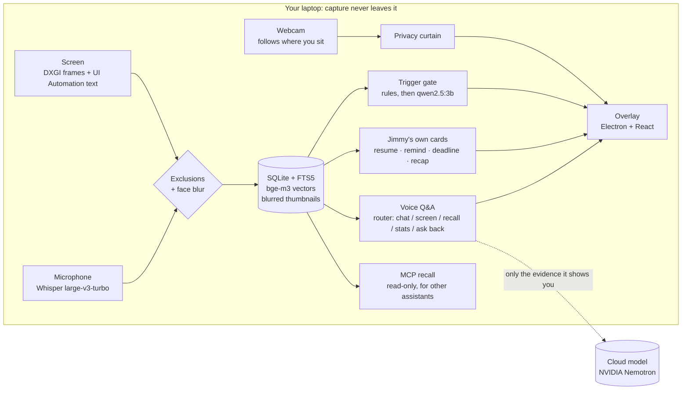
```mermaid
flowchart LR
  subgraph laptop["Your laptop: capture never leaves it"]
    direction LR
    scr["Screen<br/>DXGI frames + UI Automation text"] --> gate0{"Exclusions<br/>+ face blur"}
    mic["Microphone<br/>Whisper large-v3-turbo"] --> gate0
    cam["Webcam<br/>follows where you sit"] --> curtain["Privacy curtain"]
    gate0 --> db[("SQLite + FTS5<br/>bge-m3 vectors<br/>blurred thumbnails")]
    db --> cards["Trigger gate<br/>rules, then qwen2.5:3b"]
    db --> own["Jimmy's own cards<br/>resume · remind · deadline · recap"]
    db --> ask["Voice Q&A<br/>router: chat / screen / recall / stats / ask back"]
    cards --> ui["Overlay<br/>Electron + React"]
    own --> ui
    ask --> ui
    curtain --> ui
    db --> mcp["MCP recall<br/>read-only, for other assistants"]
  end
  ask -. "only the evidence it shows you" .-> llm[("Cloud model<br/>NVIDIA Nemotron")]
```

### The life of a question

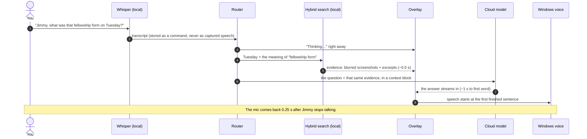
```mermaid
sequenceDiagram
  autonumber
  actor You
  participant W as Whisper (local)
  participant R as Router
  participant S as Hybrid search (local)
  participant O as Overlay
  participant M as Cloud model
  participant V as Windows voice
  You->>W: "Jimmy, what was that fellowship form on Tuesday?"
  W->>R: transcript (stored as a command, never as captured speech)
  R->>O: "Thinking…" right away
  R->>S: Tuesday + the meaning of "fellowship form"
  S-->>O: evidence: blurred screenshots + excerpts (~0.5 s)
  R->>M: the question + that same evidence, in a context block
  M-->>O: the answer streams in (~1 s to first word)
  O->>V: speech starts at the first finished sentence
  Note over You,V: The mic comes back 0.25 s after Jimmy stops talking
```

- **The screen becomes text immediately.** A 6 GB GPU can't fit a vision model alongside Whisper,
  so Jimmy reads exact strings through **UI Automation**, and wakes Chromium's accessibility tree so
  browsers and Electron apps are readable.
- **Capture is gated.** A 160×90 change detector skips about half of all 2-second ticks, yet catches a
  one-message chat scroll. Text seen in 3 or more capture windows (sidebars, your own name, buttons)
  counts as furniture, not content.
- **Search is hybrid.** Keyword matches (FTS5) and meaning matches (bge-m3, local) are fused with
  reciprocal-rank fusion, so *"consulting application"* finds a page titled "McKinsey Forward".
- **Cards are decided in two tiers.** Local rules decide whether to look at all. The local
  **qwen2.5:3b** model answers one typed yes/no question, a RECALL "yes" gets a second opinion from
  the cloud, and then **code writes the line** from words in the evidence and real timestamps. A
  card can't contain anything invented.
- **Commands and usage questions are answered first, without a model.** Pause, focus, reminders,
  "how long was I on…": the router handles these in code, instantly. A Hindi request makes one model
  call that returns both the English and the tool to use.
- **There's one LLM client in the repo** (`jimmy/llm.py`). Captured text reaches it only inside a
  `<context>` block, below a rule to ignore any instructions found there, because a web page saying
  *"ignore previous instructions"* is exactly the kind of thing that gets captured.

### The life of a task

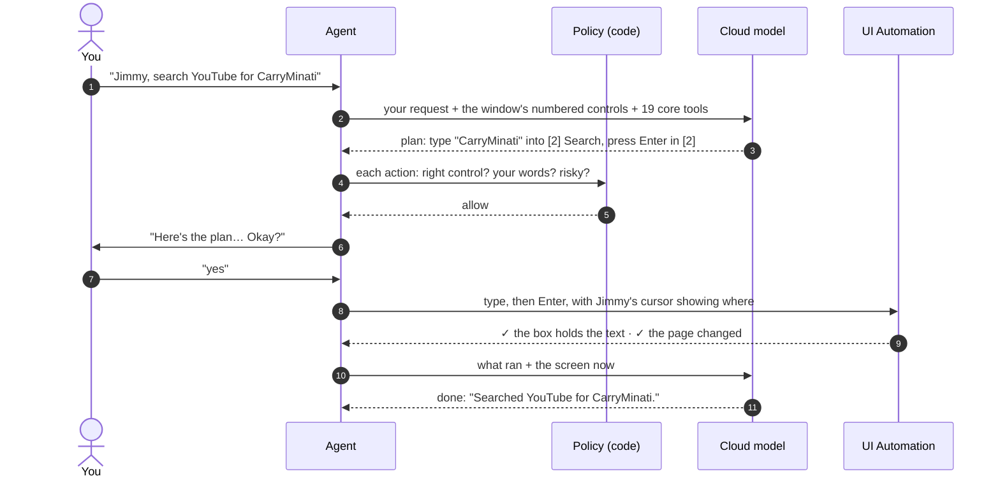
```mermaid
sequenceDiagram
  autonumber
  actor You
  participant A as Agent
  participant P as Policy (code)
  participant M as Cloud model
  participant U as UI Automation
  You->>A: "Jimmy, search YouTube for CarryMinati"
  A->>M: your request + the window's numbered controls + 19 core tools
  M-->>A: plan: type "CarryMinati" into [2] Search, press Enter in [2]
  A->>P: each action: right control? your words? risky?
  P-->>A: allow
  A->>You: "Here's the plan… Okay?"
  You->>A: "yes"
  A->>U: type, then Enter, with Jimmy's cursor showing where
  U-->>A: ✓ the box holds the text · ✓ the page changed
  A->>M: what ran + the screen now
  M-->>A: done: "Searched YouTube for CarryMinati."
```

- **One loop, native tool calls.** Each step sees Jimmy's live state, your wiki's index, your
  lists, the open apps and the window in front as numbered controls. Stable parts come first, so
  the provider can cache them between steps.
- **Fewer tools per step.** 19 core tools plus the features your words point at, about 1,400
  tokens instead of 3,300 for all 54; the model can ask for more with `more_tools`.
- **Every action is checked in code** and the model is told ✓ or ✗, instead of assuming it worked.
- **A plan's steps run back to back** after your *"yes"*: a two-step search takes two model calls,
  not four. A renamed button, a failed check or anything risky hands control back.
- **The policy layer decides, not the prompt.** Refused: password boxes, text you didn't say,
  stale or rejected controls, closing an app that isn't open. Stopped: CAPTCHAs. Asked again: anything
  that can't be undone, a site you didn't name, a button whose name reads like an instruction.
- **Every request is in the decision log** (`python -m jimmy trace`), with tokens, cache hits and checks.

### 🪶 Light on the PC

- **Efficiency mode** (Windows EcoQoS) for indexing, compaction, the wiki and the deadline scan; the
  voice path never uses it.
- **Load aware:** on battery or with the CPU above 85 % for 30 s, background work waits and the
  webcam looks half as often. Capture and voice carry on.
- **Idle means idle:** with no key or mouse for a minute and a still screen, capture checks every
  6 s instead of 2, and an unchanged desktop costs no UI Automation call at all.
- **One accessibility query per window** reads every control's properties at once, instead of
  about ten cross-process calls per control.

Read the details in [`ARCHITECTURE.md`](ARCHITECTURE.md) and [`DATA-FLOW.md`](DATA-FLOW.md).

### 📏 By the numbers

Measured on the development laptop (Ryzen 7 7840HS, RTX 4050 6 GB):

| What | Measured |
|---|---|
| Screen frame grab (DXGI) | **7–14 ms** |
| Window text (UI Automation) | **317 nodes / 4.8k chars in ~230 ms**, budget 0.6 s |
| Speech to text (Whisper large-v3-turbo) | **4 s of audio in 0.6 s**, ~1 GB VRAM |
| Hybrid search over your history | **0.5 s** (2.8 s before the performance pass) |
| First spoken word of an answer | **~1 s** |
| Card decision (qwen2.5:3b, local) | **~1 s** per question |
| Replay of 1.18 h of real history | **5 candidates → 1 card** |
| Tier 2 precision against blind judges | **0.83** (the bar was 0.80) |
| Face detection, single-threaded | **20 ms** CPU at 640 px, vs 65 ms on OpenCV's default thread pool |
| Tools sent per agent step | **19 core, ~1,400 tokens** (all 54 were ~3,300) |
| Model calls for a two-step screen task | **2** (plan, done), down from 4 |
| Agent first decision on 130 real commands | **95 %** (the D41 baseline: 71 %) |

---

## 🛡️ Privacy by construction

These are **absent code paths**, not settings that happen to be off.

| Stored | Never stored |
|---|---|
| Window app and title | Any raw, unblurred frame |
| UI text and OCR text | Anything from an excluded surface |
| Blurred thumbnails | Raw audio: only the transcript survives |
| Transcribed speech | Face embeddings of anyone but you, or any face image |
| Face **count** per frame | Face identity, names, cross-day links |
| Your own face template, only if you say *"remember my face"* (DPAPI-encrypted, this PC only) | A `faces` table or a `people` table. Neither exists, and a test asserts they don't |

- **Faces are blurred before anything is written.** The clean frame exists only inside one tick.
  The blur is verified against the detector, not by eye: a test re-runs face detection on the saved
  JPEG and requires zero hits. Faces are looked for at the full 1280 px thumbnail size, so small
  ones are caught too.
- **Excluded surfaces are never captured:** password managers, banking and payment sites,
  private/incognito windows, and Jimmy's own windows. Add your own in `data\exclusions.txt`,
  one per line:
  ```
  exe:mysecret.exe
  title:payroll
  url:internal\.example\.com
  ```
- **The mic pauses on sensitive screens,** so an OTP read aloud never reaches a transcript. The one
  exception: if another app (Teams, Zoom, Meet) is using the mic, recording continues so a meeting
  isn't lost.
- **Recording others is off.** System audio (the far end of a call) is not captured. That's a
  consent problem, not a feature flag.
- **The webcam recognises only you, and only if you ask.** By default it finds a face, then follows
  where you sit for the curtain. After *"remember my face"*, it compares a new face with your
  encrypted template once, not every frame. Every other face's vector exists for one comparison and
  is dropped. For your face only, it notes whether you're looking at the screen and whether your lips
  are moving, as yes/no values kept in memory for two minutes, so you can ask without the name. No
  frame is kept.
- **Jimmy proposes; you approve.** It acts on another app only when you ask, one action per
  *"yes"*: a scroll, or pressing / typing into the control its cursor is showing you. It never moves
  your mouse, never acts in banking or password-manager windows, and never types into a password box.
  Those rules live in a policy layer in code, which every proposed action passes, whichever model
  proposed it.
- **What leaves the laptop:** only the evidence shown with an answer (at most 6,000 characters, and
  only with a key set), the rare RECALL candidates the cloud double-checks, for a question about
  your screen (or a task that needs a look) that window's latest picture (faces already blurred; never
  an excluded window), the names of the window's buttons and boxes while Jimmy works out a request,
  and once a day what it needs to keep your wiki (your lists, your questions to it, window titles). Set
  `JIMMY_RECALL_VERIFY=none` to keep cards fully local, and `VISION_SCREEN = False` for text-only
  screen answers. If you connect the MCP server, what `recall` returns goes to that assistant too.
  The optional trace file and recipes stay on your disk and hold no text you typed or said.

A face embedding is a biometric template under India's DPDP Act whether or not it's persisted.
This design shrinks that exposure substantially; it does not take it to zero. The one stored
template is yours, created only on request, and *"forget my face"* deletes it.

<details>
<summary><b>Storage, microphone and tuning</b></summary>

- **Storage.** Thumbnails are 1280 px so they're readable when opened big, at about 80–88 KB each.
  That's roughly 30–85 MB per active hour, or 90–250 GB a year at 8 hours a day. It's all on your
  own disk, and there's no retention policy yet.
- **Which microphone.** Capture uses the Windows default input. To pick another, set `MIC_DEVICE`
  in `ambient/config.py` to part of its name, for example `"Microphone Array"`. A quiet room can
  read as near-silent because of noise suppression, so test by speaking during `ambient doctor`.
- **OCR is optional.** `pip install winocr` uses Windows' own OCR engine (offline, nothing else to
  install); Tesseract works too. Without either, canvas-rendered apps and video contribute no text.
  Normal apps are unaffected.
- **Upgrades behind flags.** Silero VAD, a wake word while paused, a still webcam, freeing the GPU
  while you're away, recipes, a local model fallback, an OpenTelemetry trace file, a turn detector,
  the Kokoro voice, int8 vectors and small thumbnails are built but off. Each flag in
  `ambient/config.py` says what to install and what to measure before turning it on.
- **Every tunable** lives in [`ambient/config.py`](ambient/config.py), with its reasoning next to it.
- **The console is kept** in `data\logs\jimmy.log` (five 2 MB files, rotating) for diagnosing a
  session: what was heard and what was on screen appear only as lengths, never as text.

</details>

---

## 🔬 Engineering notes

Every non-obvious call is written down with its evidence in
[`DECISIONS-AND-WHY.md`](DECISIONS-AND-WHY.md), 52 so far. A few worth knowing:

| Finding | What it changed |
|---|---|
| **Chromium hides its UI from screen readers until one asks.** Cold, an Electron window exposed 24 nodes; once woken, 317. | Jimmy sends the standard accessibility signal once per window. Without it, browsers would be unreadable. ([D3](DECISIONS-AND-WHY.md#d3--wake-chromiums-accessibility-engine-deliberately)) |
| **A blur that looks strong can still be re-detected.** The first version fooled the eye but not the face detector. | Blur strength was set by sweeping it against the detector, after the JPEG round-trip. ([D7](DECISIONS-AND-WHY.md#d7--blur-strength-set-by-re-detection-not-by-eye)) |
| **Whisper invents text from silence.** It decoded silence as "you" and white noise as "Thanks." | Segments are filtered on loudness, no-speech probability, confidence and a blocklist. ([D5](DECISIONS-AND-WHY.md#d5--whisper-output-is-filtered-not-trusted)) |
| **A 64-bit dhash was blind to text.** It missed 7 of 8 one-message chat scrolls. | It was replaced with a pixel-delta gate tuned on real dark-theme scrolls. ([D18](DECISIONS-AND-WHY.md#d18--fixes-from-the-first-real-hour)) |
| **Small models copy prompt examples.** qwen2.5:7b answered five candidates with the prompt's example line. | Models answer one yes/no question at a time, and code writes everything you see. ([D20](DECISIONS-AND-WHY.md#d20--card-decisions-run-on-a-local-model-ollama-the-model-picks-code-writes)) |
| **Screen furniture looks like content.** Every false RECALL rested on a sidebar or a friend list. | Lines seen in 3 or more capture windows are ignored, and the gate was closed by blind judges. ([D22](DECISIONS-AND-WHY.md#d22--stage-3-closed-on-recorded-data-checked-by-blind-ai-judges)) |
| **`useEffect(() => el.scrollIntoView())` blanked the overlay.** In this Chromium it returns a Promise, which React then called as a cleanup. | A test scans the overlay source for effects without braces. ([D26](DECISIONS-AND-WHY.md#d26--the-overlay-blanked-on-the-second-answer-a-promise-returned-from-an-effect)) |
| **`localhost` costs 2.4 s per connection on Windows.** It tries IPv6 first, but Ollama listens on IPv4. | Every local call uses `127.0.0.1` with kept-open clients, and search went from 2.8 s to 0.5 s. ([D38](DECISIONS-AND-WHY.md#d38--performance-with-no-feature-or-accuracy-given-up)) |

| **Every agent step sent all 53 tools**, about 3,300 tokens before the request was even read. | A fixed core plus the feature groups the words point at, and a `more_tools` escape hatch. ([D48](DECISIONS-AND-WHY.md#d48--the-agent-sees-fewer-tools-checks-every-action-and-is-scored-on-whole-tasks)) |
| **Agents assume their actions worked.** It's the failure the computer-use guides name first. | After each action, code reads the box's value or compares the page and tells the model ✓ or ✗. ([D48](DECISIONS-AND-WHY.md#d48--the-agent-sees-fewer-tools-checks-every-action-and-is-scored-on-whole-tasks)) |
| **Rules in a prompt lose to a page written to beat them.** Captured text is exactly where an injection would hide. | The guards moved into a policy layer in code that judges every action, whatever model proposed it. ([D49](DECISIONS-AND-WHY.md#d49--a-policy-layer-in-code-a-plans-actions-run-without-a-model-call-each)) |
| **A model call per click is slow.** A two-step search took four calls. | A plan carries its first concrete actions; after the yes they run back to back until a surprise. ([D49](DECISIONS-AND-WHY.md#d49--a-policy-layer-in-code-a-plans-actions-run-without-a-model-call-each)) |

The performance pass (D38) was checked for **equivalence on a frozen copy of the real database**:
43 read paths gave the same results before and after.

---

## 🗺️ Status and roadmap

| Stage | What it delivers | |
|---|---|:-:|
| 1 · Capture | Screen and speech into searchable text, faces blurred, exclusions first | ✅ |
| 2 · Jimmy core | One LLM client, memory, the plugin seam, terminal chat | ✅ |
| 3 · Trigger gate | RECALL and FOCUS cards, blind-judged before shipping | ✅ |
| 4 · Overlay | The pill, cards and answers: transparent, click-through, never steals focus | ✅ |
| 5 · Recall | Hybrid keyword + meaning search and the timeline | ✅ |
| + · Voice | "Jimmy, …", spoken answers, conversation, asking back | ✅ |
| + · Insights | Day map, time per app, usage answers, voice commands | ✅ |
| + · Autonomy | Its own cards, reminders, deadlines, hands-free UI, privacy curtain | ✅ |
| + · First real session | Routing, tool picking, ask-back, scroll, volume, decluttering | ✅ |
| + · Polish | Remember my face, English + Hindi, a performance pass | ✅ |
| + · Live | A curtain that follows you, resting while you're away, asking without the name, timers, forgetting a span | ✅ |
| + · Hands and eyes | Understanding in context, your lists by voice and in a Memory tab, seeing the screen, a virtual cursor (one action per yes) | ✅ |
| + · Agent | One loop that sees its state, your wiki, your lists and the screen; multi-step tasks on one yes; a decision log; 95 % on 130 real commands (was 71 %) | ✅ |
| + · Lighter and safer | Efficiency mode, a slower idle tick, cached UI Automation; fewer tools per step, every action checked, a policy layer in code, a plan's steps run back to back; OCR via Windows; read-only MCP recall. Voice, GPU and memory upgrades built behind flags, to be measured | ✅ |

What's next is measuring those flagged upgrades on the laptop, one at a time (see
[`TIMELINE.md`](TIMELINE.md)). Other ideas are in [`SCOPE.md`](SCOPE.md) →
*Possible future changes*. The biggest known gap: the vision models this key can reach are
mid-size, so a picture alone (canvases, video) is described less exactly than a window's text.

<details>
<summary><b>Checks</b>: 175 assert-based checks, a 177-utterance command matrix and two live evals</summary>

```powershell
.\.venv\Scripts\python.exe tests\test_stage1.py    # 15 · capture, blur, store
.\.venv\Scripts\python.exe tests\test_stage2.py    # 17 · LLM client, mocked network
.\.venv\Scripts\python.exe tests\test_stage3.py    # 11 · trigger gate, no network
.\.venv\Scripts\python.exe tests\test_stage4.py    #  5 · overlay API and window flags
.\.venv\Scripts\python.exe tests\test_stage5.py    # 14 · recall, voice, ask-back, demo
.\.venv\Scripts\python.exe tests\test_stage6.py    #  6 · insights, usage answers, commands
.\.venv\Scripts\python.exe tests\test_stage7.py    # 11 · own cards, hands-free, curtain
.\.venv\Scripts\python.exe tests\test_stage8.py    #  7 · the first real session's misses
.\.venv\Scripts\python.exe tests\test_stage9.py    # 14 · curtain that follows you, no-name asks, calibration, forget, timers
.\.venv\Scripts\python.exe tests\test_stage10.py   #  7 · your lists by voice, heard feedback, cursor, Memory tab, vision
.\.venv\Scripts\python.exe tests\test_stage11.py   # 10 · the agent: plans, risky steps, typing guard, trace, wiki
.\.venv\Scripts\python.exe tests\test_stage12.py   # 28 · the 2026-10-05 session's misses, and pause
.\.venv\Scripts\python.exe tests\test_stage13.py   # 24 · footprint, tool retrieval, checks, policy, the flagged upgrades
.\.venv\Scripts\python.exe tests\eval_agent.py     #  live: 130 real commands, rules + agent (95 %)
.\.venv\Scripts\python.exe tests\eval_trajectory.py  #  live: 8 whole tasks on invented screens
.\.venv\Scripts\python.exe tests\test_face.py      #  6 · remember my face
.\.venv\Scripts\python.exe tests\test_commands.py  #  4 · 177 commands, talk that mustn't trigger, a drill
.\.venv\Scripts\python.exe tests\eval_tools.py     #  live: the model's tool pick, English + Hindi
.\.venv\Scripts\python.exe tests\equiv_db.py snap before   # then change code, snap after, diff
```

OpenCV prints `net_impl_backend ... Targets are not supported` on import. It's harmless.

</details>

<details>
<summary><b>Project layout</b></summary>

```
Jimmy/
├── ambient/            the ambient layer: capture, redaction, gate, voice, overlay API
│   ├── bus.py            the one loop; capture-window lifecycle
│   ├── screen.py         DXGI capture, change gate, UI Automation text, thumbnails
│   ├── audio.py          WASAPI capture, VAD, Whisper + hallucination filtering
│   ├── redact.py         exclusions + the ephemeral face stage (the sensitive file)
│   ├── db.py             SQLite + FTS5 store
│   ├── recall.py         chunking, bge-m3 vectors, hybrid search
│   ├── gate.py           Tier 1 trigger rules and replay
│   ├── ask.py            wake word, router, evidence, conversation, Windows voice
│   ├── proactive.py      resume / suggest / remind / deadline / recap cards
│   ├── insights.py       where the day went, estimated from captures
│   ├── presence.py       webcam presence for the privacy curtain
│   ├── act.py            the virtual cursor's hands (UI Automation, one action per yes)
│   ├── agent.py          the agent: context, native tools, the loop, plan approval
│   ├── policy.py         what the agent may do, decided in code (refuse / stop / ask / allow)
│   ├── power.py          efficiency mode, battery and busy-CPU checks for background work
│   ├── logs.py           the console kept in data\logs, captured text cut to lengths
│   ├── api.py            127.0.0.1 API for the overlay (stdlib only)
│   └── config.py         every tunable, with its reasoning
├── jimmy/              the core: the one LLM client, memory, card engine, user wiki,
│                       MCP recall (mcp.py), OpenTelemetry export (otel.py)
├── overlay/            Electron + React + Tailwind + Motion: pill, cards, answers, timeline, insights
├── models/             YuNet + SFace ONNX (small, pinned, committed on purpose)
├── tests/              assert-based checks, no framework; live evals; frozen eval sets in tests/eval/
├── docs/               the agent/footprint research roadmap; img/: README screenshots (invented data only)
└── data/               your captures; never committed
```

</details>

---

## 📚 Project docs

| Doc | What's in it |
|---|---|
| [`AMBIENT_LAYER.md`](AMBIENT_LAYER.md) | The build spec: the authority on what to build and what not to |
| [`ARCHITECTURE.md`](ARCHITECTURE.md) | Components, threading, and why each choice was made |
| [`DATA-FLOW.md`](DATA-FLOW.md) | The capture tick, the audio path, the schema |
| [`DECISIONS-AND-WHY.md`](DECISIONS-AND-WHY.md) | Every non-obvious call, with the evidence behind it |
| [`SCOPE.md`](SCOPE.md) | What's in, what's out, what's owed |
| [`TIMELINE.md`](TIMELINE.md) | Stage status and acceptance gates |
| [`docs/RESEARCH-AGENT-2026-10.md`](docs/RESEARCH-AGENT-2026-10.md) | The research behind D47–D52: where Jimmy stands, what was built, what to measure |
| [`CLAUDE.md`](CLAUDE.md) | Orientation for AI coding sessions; verified environment facts |

<p align="center"><sub>Built for one laptop and one person.</sub></p>
